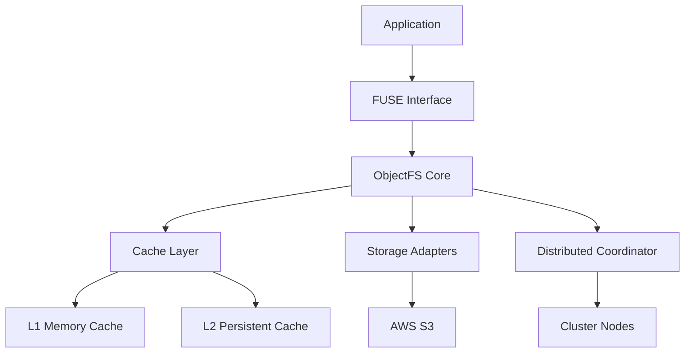

# Introduction to ObjectFS

ObjectFS is a high-performance POSIX filesystem that provides seamless access to AWS S3.
It bridges the gap between traditional filesystems and S3 object storage, offering the best
of both worlds with deep S3 optimizations.

## What is ObjectFS?

ObjectFS uses FUSE (Filesystem in Userspace) to mount S3 buckets as local directories. This means you can:

- **Use standard file operations** (`ls`, `cat`, `cp`, `mv`, etc.) on S3
- **Run existing applications** without modification  
- **Access massive datasets** stored in S3 as if they were local files
- **Benefit from advanced caching** and performance optimizations

## Key Features

### 🚀 High Performance

- **Multi-level caching** with L1 memory and L2 persistent caches
- **Predictive prefetching** using machine learning models
- **Intelligent eviction** strategies for optimal cache utilization
- **Parallel I/O operations** for maximum throughput

### 🔧 Easy Integration

- **Drop-in replacement** for traditional filesystems
- **POSIX compliance** ensures compatibility with existing tools
- **Multiple mounting options** for different use cases
- **Hot configuration reloading** without unmounting

### 🚀 S3 Deep Integration

- **AWS S3 storage classes** with intelligent tiering support
- **S3 Transfer Acceleration** for faster uploads/downloads
- **S3 lifecycle management** integration
- **Cost optimization** with automatic S3 tiering and storage class transitions

### 🏗️ Enterprise Ready

- **Distributed clusters** for high availability
- **Load balancing** across multiple nodes
- **Health monitoring** and metrics collection
- **Authentication and authorization** with RBAC

## Architecture Overview

### Core Components

1. **FUSE Interface**: Translates POSIX filesystem calls to ObjectFS operations
2. **Cache Layer**: Multi-level caching system with intelligent prefetching
3. **S3 Adapter**: Optimized interface exclusively for AWS S3 with intelligent tiering
4. **Distributed Coordinator**: Manages cluster membership and data consistency

## Use Cases

### Data Science & Machine Learning

- Access training datasets stored in S3
- Stream large models and data files efficiently
- Collaborative data sharing across teams
- Cost-effective storage for experimental data

### Container Storage

- Persistent volumes for Kubernetes workloads
- Shared storage across container instances
- Configuration and secret management
- CI/CD artifact storage

### Media & Content Processing

- Video transcoding from S3 storage
- Image processing pipelines with S3 integration
- Content distribution workflows using S3
- Digital asset management with S3 lifecycle policies

### Backup & Archive

- Long-term data retention
- Automated lifecycle management
- Disaster recovery solutions
- Compliance and governance

## Getting Started

Ready to get started? Head over to our [Installation Guide](/guide/installation) to set up
ObjectFS, or try our [Quick Start](/guide/getting-started) tutorial.

## Community & Support

- **GitHub**: [Source code and issues](https://github.com/objectfs/objectfs)
- **Community Forum**: [Ask questions and share experiences](https://community.objectfs.io)
- **Documentation**: [Complete guides and API reference](https://docs.objectfs.io)
- **Commercial Support**: [Enterprise support](mailto:support@objectfs.io)

## License

ObjectFS is released under the MIT License, making it free for both commercial and personal use.
