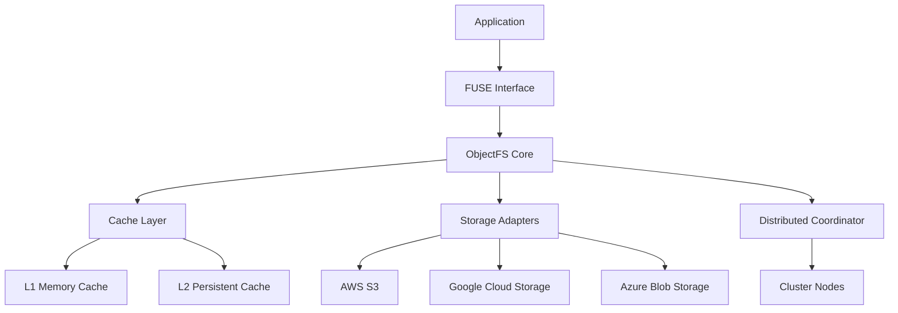

# Introduction to ObjectFS

ObjectFS is a high-performance POSIX filesystem that provides seamless access to object
storage backends like AWS S3, Google Cloud Storage, and Azure Blob Storage. It bridges
the gap between traditional filesystems and modern cloud storage, offering the best
of both worlds.

## What is ObjectFS?

ObjectFS uses FUSE (Filesystem in Userspace) to mount object storage buckets as local directories. This means you can:

- **Use standard file operations** (`ls`, `cat`, `cp`, `mv`, etc.) on cloud storage
- **Run existing applications** without modification
- **Access massive datasets** stored in object storage as if they were local files
- **Benefit from advanced caching** and performance optimizations

## Key Features

### 🚀 High Performance

- **Multi-level caching** with L1 memory and L2 persistent caches
- **Predictive prefetching** using machine learning models
- **Intelligent eviction** strategies for optimal cache utilization
- **Parallel I/O operations** for maximum throughput

### 🔧 Easy Integration

- **Drop-in replacement** for traditional filesystems
- **POSIX compliance** ensures compatibility with existing tools
- **Multiple mounting options** for different use cases
- **Hot configuration reloading** without unmounting

### 🌐 Multi-Cloud Support

- **AWS S3** with full feature support including storage classes
- **Google Cloud Storage** with lifecycle management
- **Azure Blob Storage** with hot/cool/archive tiers
- **Cost optimization** with automatic tiering

### 🏗️ Enterprise Ready

- **Distributed clusters** for high availability
- **Load balancing** across multiple nodes
- **Health monitoring** and metrics collection
- **Authentication and authorization** with RBAC

## Architecture Overview

### Core Components

1. **FUSE Interface**: Translates POSIX filesystem calls to ObjectFS operations
2. **Cache Layer**: Multi-level caching system with intelligent prefetching
3. **Storage Adapters**: Unified interface for different object storage backends
4. **Distributed Coordinator**: Manages cluster membership and data consistency

## Use Cases

### Data Science & Machine Learning

- Access training datasets stored in object storage
- Stream large models and data files efficiently
- Collaborative data sharing across teams
- Cost-effective storage for experimental data

### Container Storage

- Persistent volumes for Kubernetes workloads
- Shared storage across container instances
- Configuration and secret management
- CI/CD artifact storage

### Media & Content Processing

- Video transcoding from cloud storage
- Image processing pipelines
- Content distribution workflows
- Digital asset management

### Backup & Archive

- Long-term data retention
- Automated lifecycle management
- Disaster recovery solutions
- Compliance and governance

## Getting Started

Ready to get started? Head over to our [Installation Guide](/guide/installation) to set up
ObjectFS, or try our [Quick Start](/guide/getting-started) tutorial.

## Community & Support

- **GitHub**: [Source code and issues](https://github.com/objectfs/objectfs)
- **Community Forum**: [Ask questions and share experiences](https://community.objectfs.io)
- **Documentation**: [Complete guides and API reference](https://docs.objectfs.io)
- **Commercial Support**: [Enterprise support](mailto:support@objectfs.io)

## License

ObjectFS is released under the MIT License, making it free for both commercial and personal use.
