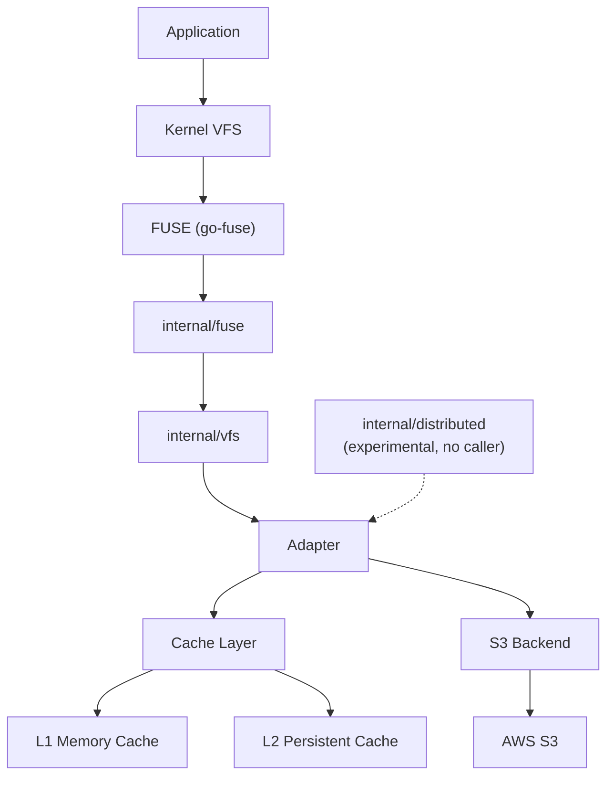

# Introduction to ObjectFS

ObjectFS presents a POSIX *interface* over AWS S3 using FUSE, so ordinary tools can read and write
objects as files. It is **not** a POSIX-compliant filesystem — roughly 10 of ~40 VFS operations are
implemented, and the gap is structural rather than incidental: S3 has no rename, no hard links, and
no partial write. The
[supported-operations table](https://github.com/scttfrdmn/objectfs/blob/main/README.md) is the
authority for what works, what fails by design, and which tools are known not to work. Check it
before pointing a workload here.

## What is ObjectFS?

ObjectFS uses FUSE (Filesystem in Userspace) to mount S3 buckets as local directories. This means
you can:

- **Use standard file operations** — `ls`, `cat`, `cp`, and redirection. Not `mv`: there is no
  `rename`, and it returns `ENOTSUP`
- **Access datasets stored in S3** as if they were local files, without downloading them first
- **Run applications that read and write whole files.** Applications needing rename, hard links,
  extended attributes, or byte-range locking will not work — `git`, `sqlite3`, and `tar -x` are
  known not to

## Key Features

### 🚀 Performance

- **Multi-level caching** with an L1 memory cache and an L2 persistent cache
- **Predictive prefetching**, which uses a pattern detector and a size heuristic. The ML predictor
  it can take is not set on the mount path
- **Parallel ranged reads** above a configurable object-size threshold

No throughput figure is quoted here. Anything of that kind would need to cite a benchmark under
[`benchmarks/`](https://github.com/scttfrdmn/objectfs/tree/main/benchmarks) and the parameters it
ran with — see the rule in `CONTRIBUTING.md`. This page previously claimed POSIX compliance, hot
configuration reloading, RBAC, and load balancing; each is corrected or removed below, and none
was true when written.

### 🔧 Integration

- **Multiple mounting options** for different use cases
- **YAML or environment configuration**, validated at load with strict decoding, so a misspelled
  key is an error rather than a silently ignored line

Configuration is read once at startup. There is no hot reload: `main.go` registers `SIGHUP`
alongside `SIGINT` and `SIGTERM` and treats any of the three as shutdown, so sending `SIGHUP` to a
mount **unmounts it**. That was documented as "hot configuration reloading without unmounting",
which is the trap stated as a feature.

### 🚀 S3 Integration

- **AWS S3 storage classes**, including Intelligent-Tiering, selectable per mount
- **S3 Transfer Acceleration**, with fallback to the standard endpoint on error
- **Server-side encryption** — SSE-S3 or SSE-KMS, with bucket keys — on every write

ObjectFS does not call the S3 lifecycle API, so it does not manage lifecycle policies; set those on
the bucket. Cost tracking and tier transitions have code but no path from a mount that reaches
them — see the [Not yet wired up](https://github.com/scttfrdmn/objectfs/blob/main/docs/index.md)
table.

### 🏗️ Operational

- **Health monitoring** with a circuit breaker and retry, and a Prometheus metrics endpoint

**There is no authentication or authorization layer, and no RBAC.** Access control is IAM's:
whoever can read the credentials the mount runs with has exactly that access. Multi-node
coordination and load balancing exist in `internal/distributed` and are **experimental** — nothing
outside that package imports it, so neither is reachable from a mount today.

## Architecture Overview

```mermaid
graph TB
    A[Application] --> B[Kernel VFS]
    B --> C["FUSE (go-fuse)"]
    C --> D["internal/fuse"]
    D --> E["internal/vfs"]
    E --> F["Adapter"]
    F --> G[Cache Layer]
    F --> H["S3 Backend"]
    G --> I[L1 Memory Cache]
    G --> J[L2 Persistent Cache]
    H --> K[AWS S3]
    L["internal/distributed<br/>(experimental, no caller)"] -.-> F
```

### Core Components

1. **`internal/fuse`**: the go-fuse binding — kernel types in, `vfs` calls out, error mapping.
   Constrained to `linux || darwin`; Windows is unsupported
2. **`internal/vfs`**: POSIX semantics — attributes, the handle table, dirty byte ranges, and
   read-modify-write on flush. Depends on nothing FUSE, so it is testable without a mount
3. **Cache Layer**: L1 memory and L2 persistent, with prefetching
4. **S3 Backend**: AWS S3 only, with parallel ranged reads, multipart upload, and retry behind a
   circuit breaker

The distributed coordinator is drawn with a dashed line because that is what it is: nothing outside
`internal/distributed` imports it, so cluster membership and consistency are not part of the path a
mount takes. It was previously drawn as a solid component of the architecture.

## Use Cases

The target is research computing and institutional deployments: read-mostly access to large
datasets that already live in S3, by tools that work in whole files.

### Data Science & Machine Learning

- Read training datasets stored in S3 without staging them to local disk first
- Stream large model and data files
- Share a read-only dataset across a team, since every reader sees the same objects

Note the write-side constraint: there is no cross-host locking, so two mounts writing the same key
is last-writer-wins with no error. `flock` is host-local — it succeeds and means nothing to another
mount of the same bucket.

### Media & Content Processing

- Transcoding and image-processing pipelines that read whole files and write whole files
- Content workflows over data already in S3

### Backup & Archive

- Long-term retention on the Glacier storage classes
- Reading archived data without a separate restore-and-download step

Lifecycle transitions are the bucket's job, configured in S3 rather than in ObjectFS.

Two use cases previously listed here have been removed. **Container storage** claimed Kubernetes
persistent volumes; there is no CSI driver, no Helm chart, and no manifest in this repository.
**Compliance and governance** claimed a capability that needs an audit log, and ObjectFS writes
none.

## Getting Started

Head over to the [Installation Guide](/guide/installation) to set up ObjectFS, or the
[Quick Start](/guide/getting-started) tutorial.

## Community & Support

- **GitHub**: [Source code and issues](https://github.com/scttfrdmn/objectfs)
- **Discussions**: [Ask questions](https://github.com/scttfrdmn/objectfs/discussions)
- **Documentation**: the `docs/` and `docs-platform/` trees in the repository

GitHub is the only support channel. This section previously listed a community forum at
`community.objectfs.io`, a documentation site at `docs.objectfs.io`, and commercial support at
`support@objectfs.io` — none of the three resolves or is monitored, so a reader with a problem was
sent to three dead ends before finding the issue tracker.

## License

ObjectFS is released under the Apache License 2.0, making it free for both commercial and personal use.
