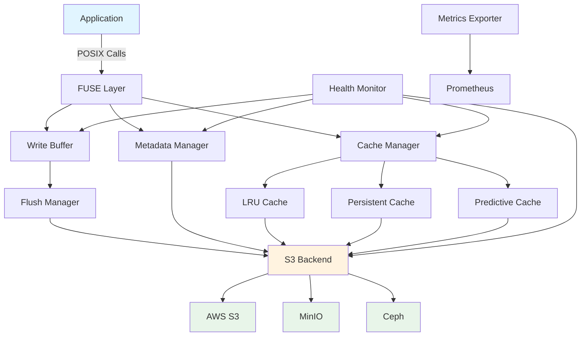

# ObjectFS

**High-Performance FUSE Filesystem for S3-Compatible Object Storage**

ObjectFS transforms S3-compatible object storage into a high-performance filesystem optimized for research computing, data science, and cloud-native applications.

---

## Overview

ObjectFS is a FUSE filesystem for Linux and macOS that presents a POSIX interface over S3-compatible
object storage. It is **not** a POSIX-compliant filesystem: roughly 10 of ~40 VFS operations are
implemented, and several others fail by design rather than silently doing the wrong thing. The
[supported-operations table in the README](https://github.com/scttfrdmn/objectfs#supported-operations)
is the authority on what works, what errors, and which tools are known not to work.

What is implemented and on the mount path today:

- **Multi-tier caching** (LRU, persistent, predictive)
- **Write buffering** with dirty-range tracking and read-modify-write flush
- **SHA-256 verification** of whole-object reads against the checksum recorded at write
- **Transparent compression** (ZSTD, LZ4) — opt-in, off by default
- **Health monitoring** and metrics endpoints

Some documented capabilities are not on that path. See [Not yet wired up](#not-yet-wired-up) below,
which names them rather than leaving them mixed in with the list above.

---

## Key Features

### 🚀 Performance

- **Multi-tier caching**: LRU, persistent, and predictive cache strategies
- **TCP congestion control selection**: `congestion_algorithm: bbr` sets `TCP_CONGESTION` per socket
  on Linux ≥ 4.9; ignored on macOS, which has no per-socket equivalent
- **Parallel I/O**: Concurrent read/write operations
- **Prefetching**: Smart data prefetching for sequential workloads
- **Write buffering**: Asynchronous writes with configurable flush policies

### 💾 S3 Integration

- **Universal compatibility**: Works with AWS S3, MinIO, Ceph, and all S3-compatible storage
- **Multi-region support**: Optimize for your region or cross-region workflows
- **Lifecycle management**: Automatic tiering to IA, Glacier, Deep Archive
- **Multipart uploads**: Efficient handling of large files
- **Retry logic**: Robust error handling with exponential backoff

### 📦 Compression

- **ZSTD and LZ4**, opt-in per mount. Off by default, because a compressed object is no longer
  readable by `aws s3 cp` or boto3. The guidance page on what that costs and when it pays is
  [issue 186](https://github.com/scttfrdmn/objectfs/issues/186); until it is written, the one
  tradeoff that has bitten users is stated in the README's data integrity section.

### 🔧 Operations

- **Systemd integration**: service templates under `deployments/`
- **Health monitoring**: health endpoint and internal checks
- **Metrics export**: Prometheus-compatible metrics endpoint
- **Structured logging**: JSON logs with configurable levels

---

## Not yet wired up

These have code in the repository and pages in this documentation, but **no path from a mount reaches
them**. Verified by import graph, not by reading the code:

| Capability | Package | Status |
|---|---|---|
| Cost tracking and per-operation billing | `internal/cost` | no importer outside itself |
| TAR.ZST archive access without extraction | `internal/archive` | no importer outside itself |
| REST API | `pkg/api` | no importer outside itself |
| Detailed per-file performance metrics | `internal/metrics` detailed collector | constructor has no non-test caller |
| ML tier prediction driving cache promotion | `internal/analytics` | imported by `internal/cache`, but the `Predictor` field is never set on the mount path, so the size heuristic always runs |
| Redis-backed distributed cache | `internal/cache/redis` | `cache.NewFromConfig` selects it, but nothing calls `NewFromConfig` — the adapter constructs `NewMultiLevelCache` directly |
| Multi-node coordination | `internal/distributed` | imported only by tests |

They are listed here rather than deleted from the docs because the code exists and may be wired up;
what they are not is a feature of the shipping product. Each is tracked as its own issue.

---

## Use Cases

### Research Computing

**Computational Biology**

- Access genomic datasets (BAM, FASTQ, VCF) directly from S3
- Multi-tier caching for frequently accessed reference genomes

**Physics & HPC**

- Mount simulation output directly from object storage
- Parallel I/O for particle collision data
- Predictive caching for sequential analysis workflows

**Climate Science**

- Access NetCDF climate model outputs from S3
- Persistent cache for baseline datasets

Archive access, cost tracking, and lifecycle management appeared in these lists until they were
checked against the import graph; see [Not yet wired up](#not-yet-wired-up).

### Data Engineering

- **Data lakes**: Mount S3 data lakes as filesystem for tools expecting POSIX
- **ETL pipelines**: Read/write directly to S3 without local staging
- **ML training**: Stream training data from S3 with intelligent prefetching

### Cloud-Native Applications

- **Stateful containers**: Persistent storage backed by S3
- **Log aggregation**: Collect logs directly to S3
- **Backup systems**: Mount S3 as backup destination
- **Content delivery**: Cache frequently accessed assets

---

## Architecture



---

## Quick Start

### Installation

Linux, or macOS with [macFUSE](https://macfuse.io) installed. Windows is not supported.

```bash
git clone https://github.com/scttfrdmn/objectfs.git
cd objectfs
make build          # produces ./objectfs

# or
go install github.com/scttfrdmn/objectfs/cmd/objectfs@latest
```

There is no Homebrew tap and no `.deb`/`.rpm` package. This section listed all three, plus a
`get.objectfs.io` install script; none of those channels exists, and the release workflow does not
build them. Release binaries are attached to the
[GitHub releases page](https://github.com/scttfrdmn/objectfs/releases) — that is the only prebuilt
artifact.

### Basic Usage

ObjectFS takes exactly two positional arguments — the bucket URI and the mount point. **There are no
subcommands**; `objectfs mount ...`, which this page used to show, exits with an argument error.

```bash
# Mount, using the built-in defaults
objectfs s3://my-bucket /mnt/objectfs

# With a configuration file
objectfs --config /etc/objectfs/config.yaml s3://my-bucket /mnt/objectfs

# A few knobs have flags; the rest live in the configuration file
objectfs --cache-size 4GB --max-concurrency 200 s3://my-bucket /mnt/objectfs

# Validate the configuration and exit without mounting
objectfs --dry-run --config /etc/objectfs/config.yaml s3://my-bucket /mnt/objectfs
```

`--cache-size` and `--max-concurrency` are real; `--cache-type` and `--region`, which this page also
showed, are not — the region comes from the configuration file or the AWS environment. Run
`objectfs --help` for the full flag set.

### Configuration

```yaml
# /etc/objectfs/config.yaml
storage:
  s3:
    region: us-west-2

cache:
  ttl: 5m
  persistent_cache:
    enabled: true
    directory: /var/cache/objectfs
    max_size: 100GB

performance:
  cache_size: 8GB
  connection_pool_size: 16
```

The bucket is not a config key — it comes from the `s3://bucket` argument. A key the schema does
not define is rejected at startup with the key named, so a typo cannot silently leave you on the
defaults.

---

## Performance

A table of throughput figures used to sit here — sequential read at 800-1200 MB/s, 5000+ metadata
ops/s, an 85-95% cache hit rate, and a 4.6x BBR improvement over CUBIC. No benchmark in this
repository produced any of them, and the last one was CargoShip's number for CargoShip's workload,
restated as ObjectFS's. A reader had no way to tell which of those five rows was measured. None were.

There is machinery for producing real ones: `benchmarks/` has a suite and `benchstat` comparison
instructions. Until this page can show output from that suite against a named bucket, region, and
object size, it will say nothing about throughput rather than invent it.

What *can* be said without a benchmark, because it follows from the design:

- A read served from the L1 or L2 cache does not make an S3 request. A read that misses does.
- Whole-object reads are verified against the SHA-256 recorded at write; partial reads are not.
- `stat` on an uncached path is one `HeadObject` per path component.

---

## Personas

ObjectFS is aimed at academic and research computing:

- 🧬 **Computational Biologist**: genomics, proteomics, variant analysis
- ⚛️ **Physics Researcher**: HPC simulations, particle data
- 🌍 **Climate Scientist**: climate models, historical datasets
- 👨‍🔬 **Lab Manager / PI**: team coordination, cost management
- 🖥️ **Research Computing Staff**: infrastructure, multi-user deployments

Each of these was a link to a page in `docs/personas/`, and that directory is empty — five links,
the whole audience section, pointing at nothing. The intent was real: `persona:` labels exist on
GitHub for all five, so issues can be filed against them. The pages were not written, so the names
are left as names rather than as promises.

---

## Version Status

The current version is the `version` constant in `cmd/objectfs/main.go`, and the shipped releases are
on the [releases page](https://github.com/scttfrdmn/objectfs/releases). A table here named v0.4.0 as
current for long enough to be six releases stale, which is why this page no longer states it: prose
has no way to be told it has gone out of date.

What is planned, rather than what is current, is in
[ROADMAP.md](https://github.com/scttfrdmn/objectfs/blob/main/ROADMAP.md) and on the
[milestones](https://github.com/scttfrdmn/objectfs/milestones).

---

## Community & Support

- **GitHub**: [https://github.com/scttfrdmn/objectfs](https://github.com/scttfrdmn/objectfs)
- **Issues**: [Report bugs or request features](https://github.com/scttfrdmn/objectfs/issues)
- **Discussions**: [Community discussions](https://github.com/scttfrdmn/objectfs/discussions)
- **Contributing**: [Contribution guide](https://github.com/scttfrdmn/objectfs/blob/main/CONTRIBUTING.md)

---

## License

ObjectFS is licensed under the Apache License 2.0.

---

## Acknowledgments

ObjectFS builds on research and experience from:

- **CargoShip**: upload pipeline and congestion-control work
- **FUSE**: the kernel filesystem-in-userspace interface
- **go-fuse**: pure-Go FUSE bindings
- **Academic research computing**: Workflows and requirements from computational biology, physics, and climate science

---

*Built for researchers, by researchers.*
