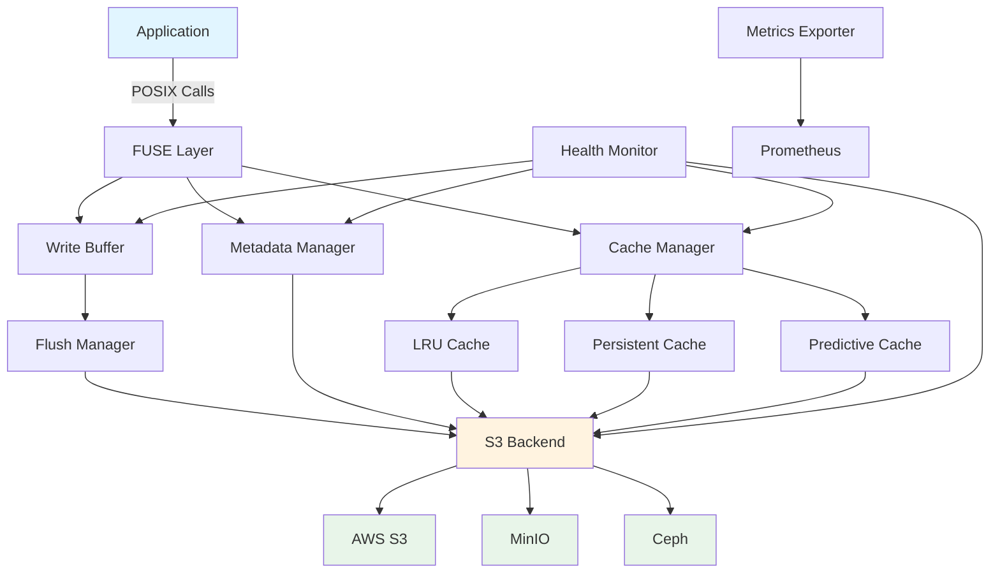

# ObjectFS

**High-Performance FUSE Filesystem for AWS S3**

ObjectFS mounts an AWS S3 bucket as a filesystem, for research computing, data science, and
cloud-native applications.

---

## Overview

ObjectFS is a FUSE filesystem for Linux and macOS that presents a POSIX interface over AWS S3. It is
**not** a POSIX-compliant filesystem — a subset of the POSIX surface is
implemented, and several operations fail by design rather than silently doing the wrong thing. The
[supported-operations table in the README](https://github.com/scttfrdmn/objectfs#supported-operations)
is the authority on what works, what errors, and which tools are known not to work.

What is implemented and on the mount path today:

- **Multi-tier caching** (LRU, persistent, predictive)
- **Write buffering** with dirty-range tracking and read-modify-write flush
- **SHA-256 verification** of whole-object reads against the checksum recorded at write
- **Transparent compression** (ZSTD, LZ4, gzip) — opt-in, off by default
- **Health monitoring** and metrics endpoints

Some documented capabilities are not on that path. See [Not yet wired up](#not-yet-wired-up) below,
which names them rather than leaving them mixed in with the list above.

---

## Key Features

### 🚀 Performance

- **Multi-tier caching**: LRU, persistent, and predictive cache strategies
- **TCP congestion control selection**: `congestion_algorithm: bbr` sets `TCP_CONGESTION` per socket
  on Linux ≥ 4.9; ignored on macOS, which has no per-socket equivalent
- **Parallel I/O**: Concurrent read/write operations
- **Read-ahead**: prefetches ahead of a sequential reader, configured by `performance.read_ahead` —
  five keys, all of which now reach the prefetcher. The block previously had twenty, describing a
  strategy selector and an ML predictor, and reached no code at all
  ([read-ahead](features/read-ahead.md))
- **Write buffering**: Asynchronous writes with configurable flush policies

### 💾 S3 Integration

- **AWS S3 first, others best-effort**: AWS S3 is the target and ObjectFS uses every S3 capability
  that benefits it. MinIO, Ceph RGW, RustFS and other S3-compatible endpoints work for plain filesystem use
  and get a fallback or a reduced capability where they diverge — established by probing the
  endpoint, not by a config flag. "Universal compatibility" is not claimed: RGW 19.2.0 fails the
  conditional-write probe, so coordination declines to start there. A performance capability falls
  back silently; a correctness capability fails closed. See
  [conditional-write compatibility](design/conditional-write-compatibility.md)
- **Multi-region support**: Optimize for your region or cross-region workflows
- **Storage class per mount**: `storage_tier` decides the class every object is written with, and
  `cost_optimization.small_objects_on_standard` diverts an object to STANDARD when the configured tier
  would bill it as larger than it is *and* STANDARD is actually cheaper for it. Automatic *transitions*
  between classes are not a feature — see [Not yet wired up](#not-yet-wired-up)
- **Multipart uploads**: Efficient handling of large files
- **Retry logic**: Robust error handling with exponential backoff

### 📦 Compression

- **ZSTD, LZ4, and gzip**, opt-in per mount. Off by default, because a compressed object is no longer
  readable by `aws s3 cp` or boto3 — both hand back the compressed bytes with a successful exit
  status. [Transparent compression](features/compression.md) covers what that costs, which data is
  worth compressing, and when the saving is zero.

### 🔧 Operations

- **Systemd integration**: one templated unit, `configs/systemd/objectfs@.service` — `systemctl start
  objectfs@research-data` reads `/etc/objectfs/research-data.yaml`, which must set `mount.uri`
- **Health monitoring**: `/health` on `monitoring.health_checks.addr`, plus internal component checks
- **Metrics export**: Prometheus-compatible `/metrics` on `monitoring.metrics.addr`
- **Structured logging**: JSON logs with configurable levels

Both listeners are on by default, both default to loopback (`127.0.0.1:8080` and `127.0.0.1:8081`),
and neither is authenticated. `enabled: false` beside the address is the only way to turn one off; a
port of `0` is rejected rather than read as "off". [Metrics and health
endpoints](https://github.com/scttfrdmn/objectfs#metrics-and-health-endpoints) in the README has the
configuration, and
[SECURITY.md](https://github.com/scttfrdmn/objectfs/blob/main/SECURITY.md) has what publishing one
exposes.

---

## Not yet wired up

These have code in the repository and pages in this documentation, but **no path from a mount reaches
them**. Verified by import graph, not by reading the code:

| Capability | Package | Status |
|---|---|---|
| Cost tracking and per-operation billing | `internal/cost` | no importer outside itself |
| TAR.ZST archive access without extraction | `internal/archive` | no importer outside itself |
| Detailed per-file performance metrics | `internal/metrics` detailed collector | constructor has no non-test caller |
| ML tier prediction driving cache promotion | `internal/analytics` | imported by `internal/cache`, but the `Predictor` field is never set on the mount path, so the size heuristic always runs |
| Multi-node coordination | `internal/distributed` | imported only by tests |
| Automatic tier transitions and lifecycle rules | `internal/storage/s3` cost optimizer | `AnalyzeAndOptimize` has no caller on the mount path; lifecycle rules are a bucket-level API call this backend never makes. The five config keys that described them were removed in v0.11.0 rather than left accepting values ([#203](https://github.com/scttfrdmn/objectfs/issues/203)) |

They are listed here rather than deleted from the docs because the code exists and may be wired up;
what they are not is a feature of the shipping product. Each is tracked as its own issue.

One row left this table by the other route. A REST API — `pkg/api`, 12 declared routes, no importer —
was **deleted** rather than kept waiting ([#367](https://github.com/scttfrdmn/objectfs/issues/367)).
A declared-but-unserved HTTP surface is worse than an absent one: it produces documentation that
cannot be checked against behavior, and it did — the six fabricated endpoints
[#336](https://github.com/scttfrdmn/objectfs/issues/336) had to correct in the docs playground looked
plausible precisely *because* a package in the tree declared their shapes. A running mount serves two
endpoints, `/metrics` and `/health`, and those are documented above.

---

## Use Cases

### Research Computing

**Computational Biology**

- Access genomic datasets (BAM, FASTQ, VCF) directly from S3
- Multi-tier caching for frequently accessed reference genomes

**Physics & HPC**

- Mount simulation output directly from object storage
- Parallel I/O for particle collision data
- Predictive caching for sequential analysis workflows

**Climate Science**

- Access NetCDF climate model outputs from S3
- Persistent cache for baseline datasets

Archive access, cost tracking, and lifecycle management appeared in these lists until they were
checked against the import graph; see [Not yet wired up](#not-yet-wired-up).

### Data Engineering

- **Data lakes**: Mount S3 data lakes as filesystem for tools expecting POSIX
- **ETL pipelines**: Read/write directly to S3 without local staging
- **ML training**: Stream training data from S3 with intelligent prefetching

### Cloud-Native Applications

- **Stateful containers**: Persistent storage backed by S3
- **Log aggregation**: Collect logs directly to S3
- **Backup systems**: Mount S3 as backup destination
- **Content delivery**: Cache frequently accessed assets

---

## Architecture



---

## Quick Start

### Installation

Linux, or macOS with [macFUSE](https://macfuse.io) installed. Windows is not supported.

```bash
git clone https://github.com/scttfrdmn/objectfs.git
cd objectfs
make build          # produces ./objectfs

# or
go install github.com/scttfrdmn/objectfs/cmd/objectfs@latest
```

There is no Homebrew tap and no `.deb`/`.rpm` package. This section listed all three, plus a
`get.objectfs.io` install script; none of those channels exists, and the release workflow does not
build them. Release binaries are attached to the
[GitHub releases page](https://github.com/scttfrdmn/objectfs/releases) — that is the only prebuilt
artifact.

### Basic Usage

ObjectFS takes exactly two positional arguments — the bucket URI and the mount point. **There are no
subcommands**; `objectfs mount ...`, which this page used to show, exits with an argument error.

```bash
# Mount, using the built-in defaults
objectfs s3://my-bucket /mnt/objectfs

# With a configuration file
objectfs --config /etc/objectfs/config.yaml s3://my-bucket /mnt/objectfs

# A few knobs have flags; the rest live in the configuration file
objectfs --cache-size 4GB --max-concurrency 200 s3://my-bucket /mnt/objectfs

# Validate the configuration and exit without mounting
objectfs --dry-run --config /etc/objectfs/config.yaml s3://my-bucket /mnt/objectfs
```

`--cache-size` and `--max-concurrency` are real; `--cache-type` and `--region`, which this page also
showed, are not — the region comes from the configuration file or the AWS environment. Run
`objectfs --help` for the full flag set.

### Configuration

```yaml
# /etc/objectfs/config.yaml
storage:
  s3:
    region: us-west-2

cache:
  ttl: 5m
  persistent_cache:
    enabled: true
    directory: /var/cache/objectfs
    max_size: 100GB

performance:
  cache_size: 8GB
  connection_pool_size: 16
```

The bucket is not a config key — it comes from the `s3://bucket` argument. A key the schema does
not define is rejected at startup with the key named, so a typo cannot silently leave you on the
defaults.

---

## Performance

A table of throughput figures used to sit here — sequential read at 800-1200 MB/s, 5000+ metadata
ops/s, an 85-95% cache hit rate, and a 4.6x BBR improvement over CUBIC. No benchmark in this
repository produced any of them, and the last one was CargoShip's number for CargoShip's workload,
restated as ObjectFS's. A reader had no way to tell which of those five rows was measured. None were.

There is machinery for producing real ones: `benchmarks/` has a suite and `benchstat` comparison
instructions. Until this page can show output from that suite against a named bucket, region, and
object size, it will say nothing about throughput rather than invent it.

What *can* be said without a benchmark, because it follows from the design:

- A read served from the L1 or L2 cache does not make an S3 request. A read that misses does.
- Whole-object reads are verified against the SHA-256 recorded at write; partial reads are not.
- `stat` on an uncached path is one `HeadObject` per path component.

---

## Personas

ObjectFS is aimed at academic and research computing:

- 🧬 **Computational Biologist**: genomics, proteomics, variant analysis
- ⚛️ **Physics Researcher**: HPC simulations, particle data
- 🌍 **Climate Scientist**: climate models, historical datasets
- 👨‍🔬 **Lab Manager / PI**: team coordination, cost management
- 🖥️ **Research Computing Staff**: infrastructure, multi-user deployments

Each of these was a link to a page in `docs/personas/`, a directory that held no files — five links,
the whole audience section, pointing at nothing. The intent was real: `persona:` labels exist on
GitHub for all five, so issues can be filed against them. The pages were not written, so the names
are left as names rather than as promises, and the empty directory has been removed
([#224](https://github.com/scttfrdmn/objectfs/issues/224)) so it no longer implies otherwise.

---

## Version Status

The current version is the `version` constant in `cmd/objectfs/main.go`, and the shipped releases are
on the [releases page](https://github.com/scttfrdmn/objectfs/releases). A table here named v0.4.0 as
current for long enough to be six releases stale, which is why this page no longer states it: prose
has no way to be told it has gone out of date.

What is planned, rather than what is current, is in
[ROADMAP.md](https://github.com/scttfrdmn/objectfs/blob/main/ROADMAP.md) and on the
[milestones](https://github.com/scttfrdmn/objectfs/milestones).

---

## Community & Support

- **GitHub**: [https://github.com/scttfrdmn/objectfs](https://github.com/scttfrdmn/objectfs)
- **Issues**: [Report bugs or request features](https://github.com/scttfrdmn/objectfs/issues)
- **Discussions**: [Community discussions](https://github.com/scttfrdmn/objectfs/discussions)
- **Contributing**: [Contribution guide](https://github.com/scttfrdmn/objectfs/blob/main/CONTRIBUTING.md)

---

## License

ObjectFS is licensed under the Apache License 2.0.

---

## Acknowledgments

ObjectFS builds on research and experience from:

- **CargoShip**: upload pipeline and congestion-control work
- **FUSE**: the kernel filesystem-in-userspace interface
- **go-fuse**: pure-Go FUSE bindings
- **Academic research computing**: Workflows and requirements from computational biology, physics, and climate science

---

*Built for researchers, by researchers.*
