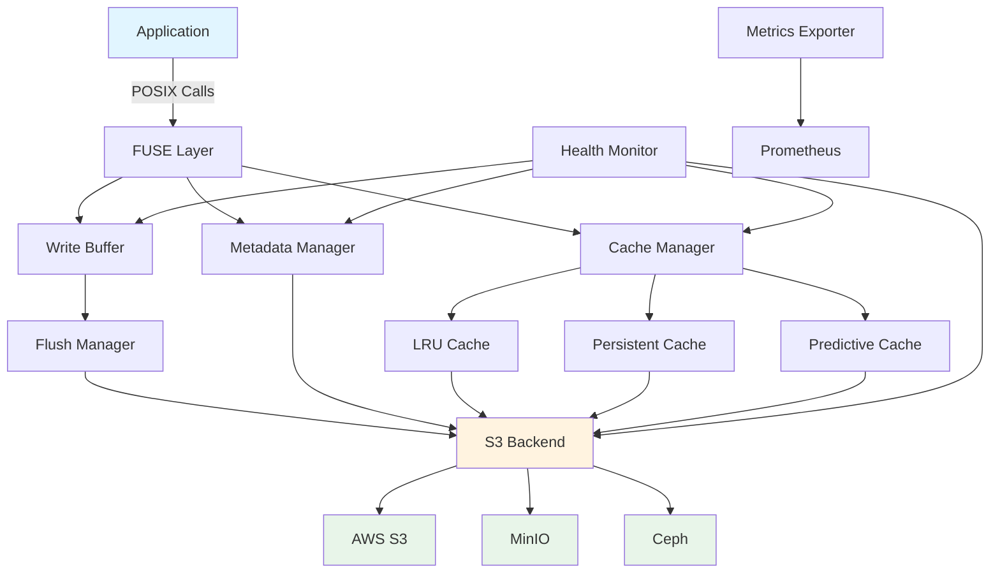

# ObjectFS

**High-Performance FUSE Filesystem for S3-Compatible Object Storage**

ObjectFS transforms S3-compatible object storage into a high-performance filesystem optimized for research computing, data science, and cloud-native applications.

---

## Overview

ObjectFS is a Linux FUSE filesystem that provides transparent, POSIX-compliant access to S3-compatible object storage with:

- **Multi-tier caching** (LRU, persistent, predictive) for optimal performance
- **Intelligent write buffering** with atomic uploads and automatic retry
- **Transparent compression** (ZSTD, LZ4) for cost savings
- **Archive access** for TAR.ZST files without extraction (v0.5.0)
- **BBR network optimization** for 4.6x throughput improvement
- **ML-based cost optimization** and real-time tracking (v0.5.0)
- **Production-ready** health monitoring and auto-remediation

---

## Key Features

### 🚀 Performance

- **Multi-tier caching**: LRU, persistent, and predictive cache strategies
- **BBR congestion control**: 4.6x throughput improvement over CUBIC
- **Parallel I/O**: Concurrent read/write operations
- **Prefetching**: Smart data prefetching for sequential workloads
- **Write buffering**: Asynchronous writes with configurable flush policies

### 💾 S3 Integration

- **Universal compatibility**: Works with AWS S3, MinIO, Ceph, and all S3-compatible storage
- **Multi-region support**: Optimize for your region or cross-region workflows
- **Lifecycle management**: Automatic tiering to IA, Glacier, Deep Archive
- **Multipart uploads**: Efficient handling of large files
- **Retry logic**: Robust error handling with exponential backoff

### 📦 Advanced Features (v0.5.0)

- **Archive access**: Mount TAR.ZST archives directly without extraction
- **Compression**: ZSTD and LZ4 with adaptive algorithm selection
- **Distributed cache**: Redis-backed L1 cache for multi-node deployments
- **Cost tracking**: Real-time per-operation cost calculation and budget alerts
- **ML optimization**: Predictive tier placement based on access patterns

### 🔧 Operations

- **Systemd integration**: Production-ready service templates
- **Health monitoring**: Automatic detection and remediation of issues
- **Metrics export**: Prometheus-compatible metrics endpoint
- **Structured logging**: JSON logs with configurable levels
- **Zero-downtime updates**: Graceful shutdown and restart

---

## Use Cases

### Research Computing

**Computational Biology**
- Access genomic datasets (BAM, FASTQ, VCF) directly from S3
- Multi-tier caching for frequently accessed reference genomes
- TAR.ZST archive support for compressed sequencing data
- Cost optimization for large-scale variant analysis

**Physics & HPC**
- Mount simulation output directly from object storage
- Parallel I/O for particle collision data
- Predictive caching for sequential analysis workflows
- BBR optimization for cross-region collaboration

**Climate Science**
- Access NetCDF climate model outputs from S3
- Persistent cache for baseline datasets
- Cost tracking for multi-year historical data
- Lifecycle management for archival data

### Data Engineering

- **Data lakes**: Mount S3 data lakes as filesystem for tools expecting POSIX
- **ETL pipelines**: Read/write directly to S3 without local staging
- **ML training**: Stream training data from S3 with intelligent prefetching
- **Data archival**: Access compressed archives without extraction

### Cloud-Native Applications

- **Stateful containers**: Persistent storage backed by S3
- **Log aggregation**: Collect logs directly to S3
- **Backup systems**: Mount S3 as backup destination
- **Content delivery**: Cache frequently accessed assets

---

## Architecture



---

## Quick Start

### Installation

```bash
# Homebrew (Linux)
brew install scttfrdmn/tap/objectfs

# Debian/Ubuntu
wget https://github.com/scttfrdmn/objectfs/releases/latest/download/objectfs_linux_x86_64.deb
sudo dpkg -i objectfs_linux_x86_64.deb

# RHEL/CentOS/Fedora
wget https://github.com/scttfrdmn/objectfs/releases/latest/download/objectfs_linux_x86_64.rpm
sudo rpm -i objectfs_linux_x86_64.rpm
```

### Basic Usage

```bash
# Mount S3 bucket
objectfs mount s3://my-bucket /mnt/objectfs

# With configuration file
objectfs mount --config /etc/objectfs/config.yaml

# With inline options
objectfs mount s3://my-bucket /mnt/objectfs \
  --cache-size 100GB \
  --cache-type persistent \
  --region us-west-2
```

### Configuration

```yaml
# /etc/objectfs/config.yaml
s3:
  bucket: my-research-data
  region: us-west-2
  endpoint: https://s3.amazonaws.com

cache:
  type: persistent
  max_size: 100GB
  path: /var/cache/objectfs

performance:
  enable_bbr: true
  worker_pool_size: 10
```

---

## Performance

ObjectFS is optimized for research computing workloads:

| Operation | Throughput | Notes |
|-----------|-----------|-------|
| Sequential Read | 800-1200 MB/s | With warm cache |
| Sequential Write | 400-600 MB/s | With write buffering |
| Random Read (cached) | <10ms latency | Persistent cache |
| Metadata Operations | 5000+ ops/s | In-memory metadata |
| Cache Hit Rate | 85-95% | Typical research workload |

**BBR Network Optimization**: 4.6x throughput improvement vs CUBIC (CargoShip benchmark)

---

## Personas

ObjectFS is designed for academic and research computing personas:

- 🧬 **[Computational Biologist](personas/computational-biologist.md)**: Genomics, proteomics, variant analysis
- ⚛️ **[Physics Researcher](personas/physics-researcher.md)**: HPC simulations, particle data
- 🌍 **[Climate Scientist](personas/climate-scientist.md)**: Climate models, historical datasets
- 👨‍🔬 **[Lab Manager / PI](personas/lab-manager.md)**: Team coordination, cost management
- 🖥️ **[Research Computing Staff](personas/research-computing.md)**: Infrastructure, multi-user deployments

---

## Version Status

| Version | Status | Released | Features |
|---------|--------|----------|----------|
| **v0.4.0** | ✅ Current | 2025-11 | Production hardening, metrics, health monitoring |
| **v0.5.0** | 🚧 In Development | Q2 2026 | Archive access, compression, distributed cache, cost optimization |
| **v0.6.0** | 📋 Planned | Q4 2026 | Production hardening phase 2 |
| **v0.7.0** | 📋 Planned | 2027 | Enterprise features |

---

## Community & Support

- **Documentation**: [https://objectfs.io](https://objectfs.io)
- **GitHub**: [https://github.com/scttfrdmn/objectfs](https://github.com/scttfrdmn/objectfs)
- **Issues**: [Report bugs or request features](https://github.com/scttfrdmn/objectfs/issues)
- **Discussions**: [Community discussions](https://github.com/scttfrdmn/objectfs/discussions)
- **Contributing**: [Contribution guide](https://github.com/scttfrdmn/objectfs/blob/main/CONTRIBUTING.md)

---

## License

ObjectFS is licensed under the Apache License 2.0.

---

## Acknowledgments

ObjectFS builds on research and experience from:
- **CargoShip**: BBR network optimization (4.6x improvement)
- **FUSE**: Linux FUSE filesystem interface
- **go-fuse**: Go FUSE bindings
- **Academic research computing**: Workflows and requirements from computational biology, physics, and climate science

---

*Built for researchers, by researchers.*
